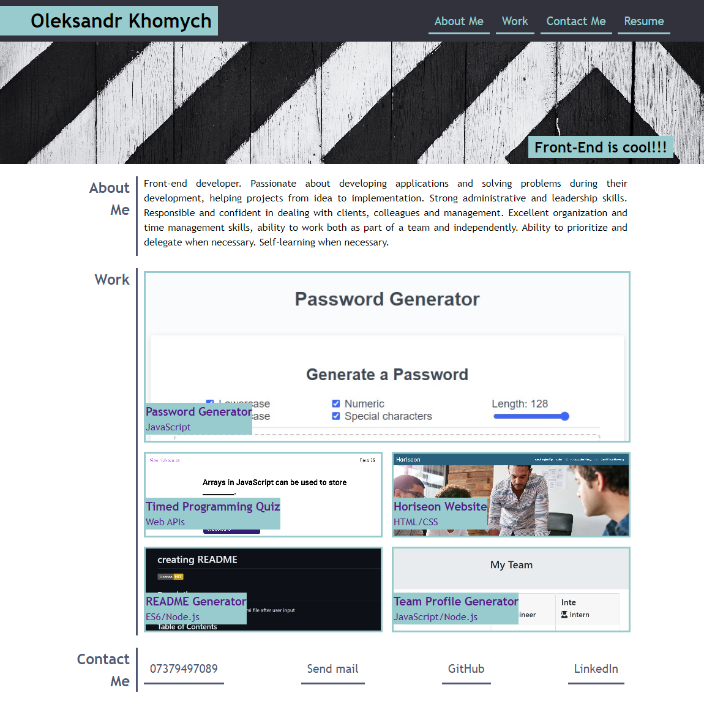

# My Portfolio

[](https://opensource.org/licenses/MIT) 



## Description
this is my portfolio. With this site, I wanted to show my abilities in website development and adaptation to different screen sizes. also indicate my contacts.

you can go to the site using the link -> [My Portfolio](https://khomych1004.github.io/My_portfolio/)

## Usage
```
run index file

```

## Credits

To create the application, I used resources on:
[MDN Web Docs](https://developer.mozilla.org)
||
[GitHub Docs](https://docs.github.com)
||
[W3Schools](https://www.w3schools.com/)

##


